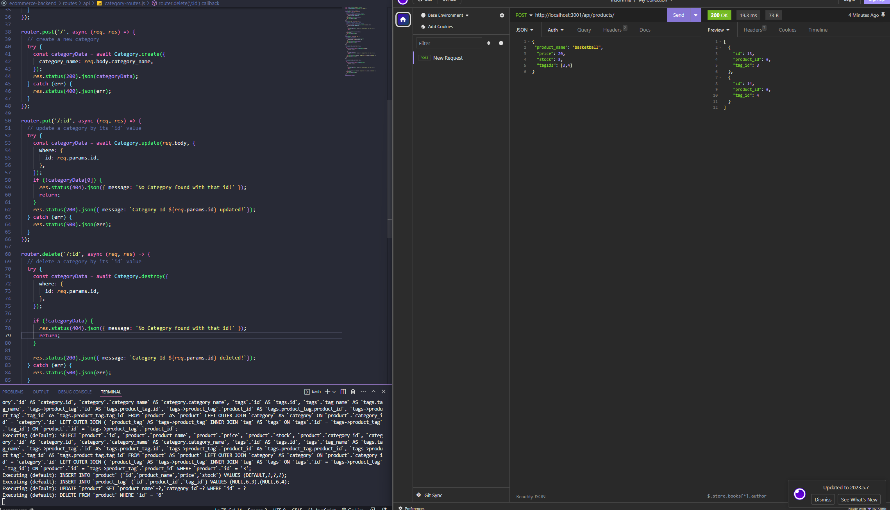

# Ecommerce Backend

## Description
[Video Walkthrough]()

This is an Ecommerce backend designed by Yoon-Jae Kim. The purpose of this app is to solidify ORM concepts learned from NW Coding Bootcamp.

The repo includes schema and seed documents within the '/db' folder to allow for quick testing. Once the db and the tables have been added to the user's local MySQL environment, the app will be ready for use.

When running the server.js file, the app will connect to the ecommerce_db database.

There are four main tables/models used in this ecommerce backend. Category, Products, Tags, and Product Tags. Products have the foreign primary category id from the category table. One category can have many products associated with it. Products also have many tags whic hare associated through the product tag table. A tag can have many products associated with it as well. 

The backend is only interactable through an API client like Insomnia, Postman, etc. Each model has its own GET, POST, PUT, and DELETE calls that the user can use to adjust the db in their local machine.

## Table of Contents
- [Installation](#installation)
- [Usage](#usage)
- [Credits](#credits)
- [License](#license)
- [How to Contribute](#how-to-contribute)
- [Tests](#tests)

## Installation
Requires node.js and MySQL to be preinstalled.

Clone the repo into your local machine. 

Execute SQL commands from 'schema.sql' in the '/db' folder. 

Run the seed files by running 'npm run seed' in your CLI.

Install required package modules by running 'npm i' in your CLI. 

Run the seed files by running 'npm run seed' in your CLI.

Create a '.env' file that links to 'ecommerce_db'. Make sure your username and pass are in the file as well.

Run 'node server.js' or 'npm start'. 

Use a client like Insomnia, Postman, etc. to use each API route and adjust the db.

## Usage
This project can be used by anyone looking to learn ORM and database manipulation using js. 

## Credits
### Github
[Yoonbacca](https://github.com/Yoonbacca)
### Email
[yoonjaekim3@gmail.com](yoonjaekim3@gmail.com)

## License
None

## How to Contribute
This is a solo project and does not require contributions at this time.

## Tests
No tests have been added to this program
  